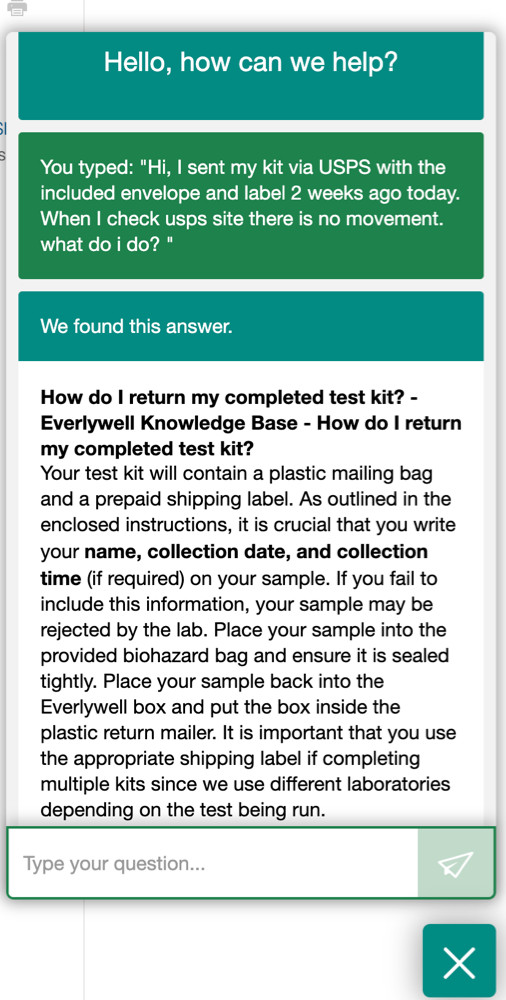
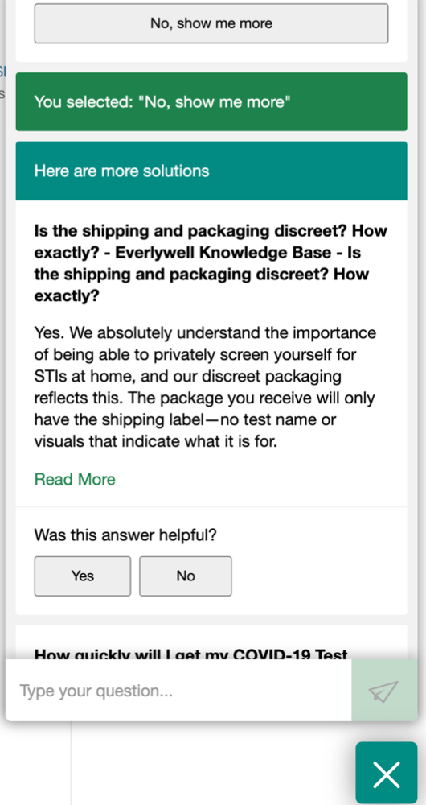
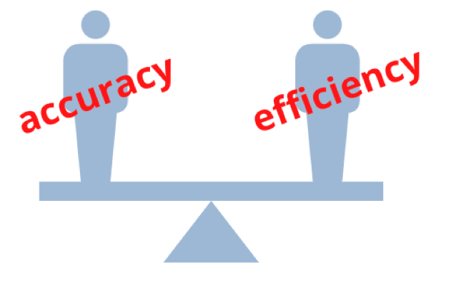
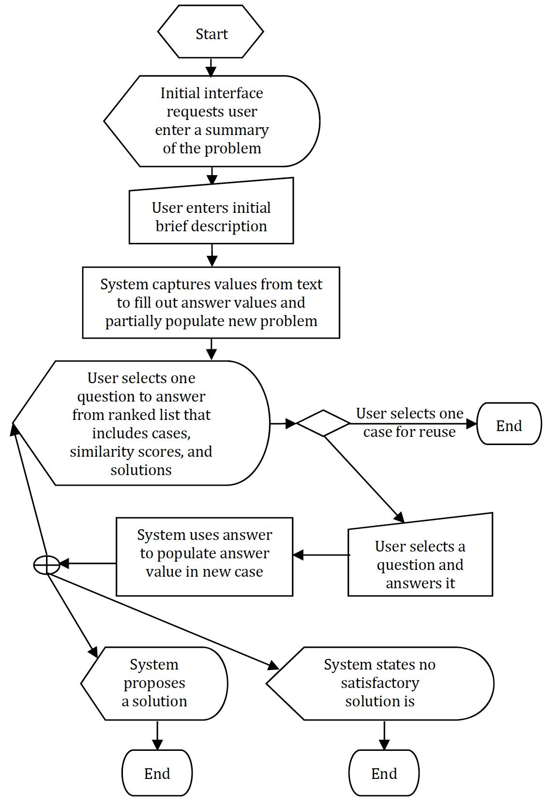

```{r xaringan-themer, include = FALSE}
library(xaringanthemer)
style_mono_light(
  base_color = "#3092FF",
  header_font_google = google_font("Josefin Sans"),
  text_font_google   = google_font("Montserrat", "300", "300i"),
  code_font_google   = google_font("Droid Mono"),
)
```

# Objectives

- Understand what a CCBR system is

- Discover applications of CCBR

- Identify knowledge containers

- Discuss latest works


---
class: inverse center middle

# What is CCBR?

---
## Conversational Case Base Reasoning

> CBR systems that interact with users in order to capture the problem in a
conversation

#### Typical Flow:

- ask user for initial description of problem

- system attempts to understand at least part of query

- system uses partial match to continue dialogue with user

- series of questions and answers ensue until the most useful case is selected to solve the user's problem

???

in most CBR systems, problem formation is the first step and prerequisite to remaining steps however in ccbr systems, the problem requires a series of steps, a dialogue, in order to formulate.

steps: the interaction by asking users for an initial description of the problem. The system then attempts to utilize its understanding of such a description in order record a partial description of the query. It then uses this partial description to start a dialogue with the user. The dialogue typically consists of questions and answers. The system needs to find questions that will help determine the most useful case that will solve the user’s problem.
---
## IRL

.pull-left[

]

.pull-right[

]


---
## Considerations

.pull-left[

- System Acceptance  
  - explanation core of research = can system justify solution?
  - CCBR must also explain the relevance of the results
  
- CCBR systems aim to reduce the amount of questions asked before a solution is reached

- Balancing the accuracy and efficiency trade-off is important in fault diagnosis and classification problems
]

.pull-right[


]

???
we know that in cbr systems, the ability to provide accurate and timely solutions is critical in building user's trust to a system. Additionally, the ability to explain its reasoning.

one of the biggest benefits of CBR is that a systems conclusions can be justified from past experiences.
However, CCBR systems are not only expected to explain the conclusions but also the relevance of test results from which conclusions are based

balancing the trade-offs between accuracy and efficiency is an important challenge in CCBR- specifically in test selection. the absence of a specific goal or hypothesis makes it difficult to explain the relevance of questions the user is asked (i.e., why they are considered useful
by the system)
---
## Charateristics

.pull-left[

- Test selection based on strategies  
  - maximize information gain to better explain relevance of question asked by user
  
- Case bases are typically heterogeneous  
  - different attributes are used to describe different cases

- Irreducible  
  - Unique solutions  
  
- Evaluated by precision & recall 
  - vs accuracy
  
- Description of the problem is not assumed to be available in advanced

.footnote[*Conversational case-based reasoning in medical decision making]
]

.pull-right[



]

???
test selection in CCBR is based on strategies so not having a specific goal or hypothesis makes it difficult to explain the relevance of questions that is asked by the user

case bases are heterogeneous  = different cases have difference attributes ---> in real world 
but ideally you have questions that can be reused in a hierarchical structure

irreducible = each case has a unique solution

measures like precision (What proportion of positive identifications (TP + FP) was actually correct?) and recall aka sensitivity (What proportion of actual positives(TP + FN) was identified correctly?) are used to evaluate CCBR systems instead of accuracy for classification systems

In contrast to traditional CBR approaches, a description of the problem to be solved is not assumed to be available in advance in CCBR. 
---
class: inverse center middle

# CCBR Applications

---
## Speech Recognition

### What is it?

> Speech recognition focuses on the translation of speech from a verbal format to a text one whereas voice recognition just seeks to identify an individual user’s voice <sup>1</sup>

> Sensor data in time series play a major role in many applications. They are
generalizations of static observations and often crucial for the diagnosis of faults and
diseases....Speech by its very nature falls into this category because it produces signal data and
happens in a temporal development <sup>2</sup>

.pull-left[

- *Vocabulary* container = versatile

- *Similarity*  
  - Phonetic similarity   
    - contains subjective elements
  - Symbolic similarity  
    - on the word level - symbols generated from feature level
    - related to semantic issues

.footnote[1.https://www.ibm.com/cloud/learn/speech-recognition]  
]

.pull-right[

- *Adaptation*  
  - Query: cleaning data to identify outliers  
  - Solution: used to correct errors in the messages on a higher level as they cannot be detected on lower levels   


- *Cases*  
  - Contain feature vectors
  - Contain words, phrases and sentences

.footnote[2.Richter MM, Weber RO (2011) Case-based reasoning: a textbook. Springer. Berlin]
]

???
vocabulary container in this kind of system is versatile as there are degrees of freedom when formulating an expression - meaning there are different ways to formulate an expression, which is good for minimizing recognition errors -  for example the usage of synonyms

similarity: 
The phonetic measure contains subjective elements like pronunciations.
the symbolic measure is related to semantics - text is static while speech is nearly impossible to repeat

adaptation: two kinds
query: takes place regularly - step of cleaning data
solution: takes place on the symbolic and the overall levels. The goal
is to correct errors in the messages
queries are spoken commands and solutions are symbolic commands that have to be performed

cases:
The feature vectors can be compared with a similarity measure. They denote actually occurring queries or solutions
---
class: inverse center middle

# Knowledge Containers

---
## Vocabulary

- The most important container  
  - dictates the language used in the interactions between the user and the conversational system
  
- Can get as complex as converting user's language to the language of the case base  
  - requires several additional transformations but allows for versatility and increased user acceptance


???
most important bc the conversation has to be conducted with the terms of the vocabulary container
dictates the language used the entire interaction - from the the language used in the initial description to the language that the system will return in the dialogue


---
## Similarity 


- Relative relevance of features must be established 

- Concurrent alteration of weights


???
similar to other systems with a few distinctions: Relative relevance of features must be established as part of the similarity measure

weights may have to be adjusted based on user feedback - for example, they only want to see solutions that do not include covid-19 tests (irl example)

---
## Adaptation

- Adaptation rarely occurs as it may lead to solutions (i.e. products) that may not exist

- In cases where modification is required, alternate values to specific features may be used

- User frustration
  - when no other answer would retrieve a valid case for a user
  - a.k.a query failure
  - can be amended by creating a new dialogue cycle to change one answer

???
It is not very common for a user to be offered a suitable solution and adaptation is required, however in some cases, if a user requests a modification, a way to proceed is by searching locally, from a reduced set of cases, for alternate values to specific features

user frustration: 
when the dialogue strategy recognizes that no other answer would retrieve a valid case for a user - this is also called "query failure". this can rectified by creating a new dialogue cycle to demonstrate to the user how many cases become available after one answer value is changed.
---
## Case Base

- May use question-answer pairs rather than feature-value pairs

- Heterogeneous collection of indices

???
as mentioned previously, one of the biggest distinctions is the inability to use the same
questions throughout the entire case base. heterogeneous cases make for heterogeneous indexing therefore come with a different collections of indices from which to pull solutions as opposed to other CBR systems.
---


---
class: inverse center middle

# Works

---
## References

```{r, load_refs, echo=FALSE}
library(RefManageR)
bib <- ReadBib("./assets/S0933365711000480.bib", check = FALSE)
ui <- "- "
```

```{r, print_refs, results='asis', echo=FALSE, warning=FALSE, message=FALSE}
writeLines(ui)
print(bib[key = "MCSHERRY201159"], 
  .opts = list(check.entries = FALSE, 
               style = "html", 
               bib.style = "authoryear"))
```

- Richter M.M., Weber R.O. (2013) Conversational CBR. In: Case-Based Reasoning. Springer, Berlin, Heidelberg. https://doi.org/10.1007/978-3-642-40167-1_20

- Gu, M., Aamodt, A.: Dialog learning in conversational cbr. In: Proceedings ofthe 19th International Florida Artificial Intelligence Research Society Conference,Florida, USA, AAAI Press (2006) 358–363 